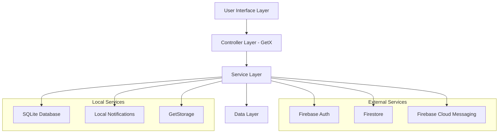

# Design Document

## Overview

This design document outlines the completion strategy for the My Pi Student Assistant app, a comprehensive Flutter application that helps students manage their academic life. The app follows a feature-first architecture with GetX state management, Firebase authentication, and hybrid local/cloud data storage.

## Architecture

### High-Level Architecture



### Feature-First Directory Structure

```
lib/
├── core/                           # Core functionality
│   ├── controllers/               # Global controllers
│   ├── database/                  # Database helpers
│   ├── routes/                    # App routing
│   └── base_*.dart               # Base classes
├── features/                      # Feature modules
│   ├── auth/                     # Authentication
│   ├── courses/                  # Course management
│   ├── assignments/              # Assignment tracking
│   ├── grades/                   # Grade analytics
│   ├── home/                     # Dashboard
│   ├── profile/                  # User profile
│   └── settings/                 # App settings
└── shared/                       # Shared components
    ├── models/                   # Data models
    ├── services/                 # Global services
    ├── themes/                   # UI theming
    ├── widgets/                  # Reusable widgets
    └── constants/                # App constants
```

## Components and Interfaces

### 1. Authentication System

**Components:**
- `AuthService`: Firebase authentication wrapper
- `AuthController`: GetX state management for auth
- `AuthException`: Custom exception handling
- `UserModel`: User data representation

**Key Interfaces:**
```dart
abstract class IAuthService {
  Future<UserModel?> signInWithEmailAndPassword(String email, String password);
  Future<UserModel?> registerWithEmailAndPassword(String email, String password);
  Future<UserModel?> signInWithGoogle();
  Future<void> signOut();
  Future<void> deleteAccount();
  Stream<UserModel?> get authStateChanges;
}
```

### 2. Course Management System

**Components:**
- `CourseController`: Course CRUD operations
- `CourseService`: Business logic layer
- `Course`: Data model with validation
- `CourseDetailPage`: UI for course information

**Key Features:**
- Course creation with schedule information
- Class reminder notifications
- Teacher and classroom tracking
- Credit hour management

### 3. Assessment System

**Components:**
- `AssessmentController`: Assessment management
- `AssessmentModel`: Assessment data with types
- `GradeCalculationService`: Weighted GPA calculation
- `AddAssessmentPage`: Assessment creation UI

**Assessment Types:**
- Quiz (15% weight, best 2 of 4)
- Midterm (20% weight)
- Assignment/Presentation (20% weight, auto-split)
- Final Exam (40% weight)
- Attendance (5% weight)

### 4. Notification System

**Components:**
- `NotificationService`: Local notification management
- Channel-based notification organization
- Exact alarm scheduling for precise timing
- Permission handling for Android 12+

**Notification Types:**
- Class reminders (recurring weekly)
- Assessment due dates (one-time)
- Grade updates (immediate)
- General app notifications

### 5. Data Synchronization

**Components:**
- `CloudDatabaseService`: Firestore operations
- `DatabaseHelper`: SQLite operations
- `StorageService`: Local preferences
- Hybrid sync strategy (local-first with cloud backup)

## Data Models

### Core Models

```dart
// Course Model
class Course {
  final String id;
  final String name;
  final String teacherName;
  final String classroom;
  final String schedule;
  final List<int> scheduleDays;
  final String classTime;
  final int reminderMinutes;
  final int credits;
  final DateTime createdAt;
  final DateTime updatedAt;
  final bool isSynced;
}

// Assessment Model
class AssessmentModel {
  final String id;
  final String courseId;
  final AssessmentType type;
  final String title;
  final String description;
  final DateTime? dueDate;
  final int? reminderMinutes;
  final double? marks;
  final double? maxMarks;
  final bool isCompleted;
}

// User Model
class UserModel {
  final String uid;
  final String email;
  final String displayName;
  final String? photoURL;
  final bool isEmailVerified;
  final DateTime createdAt;
}
```

### Database Schema

**SQLite Tables:**
```sql
-- Courses table (version 8+)
CREATE TABLE courses (
  id TEXT PRIMARY KEY,
  name TEXT NOT NULL,
  teacher_name TEXT NOT NULL,
  classroom TEXT NOT NULL,
  schedule TEXT NOT NULL,
  schedule_days TEXT,
  class_time TEXT,
  reminder_minutes INTEGER,
  credits INTEGER DEFAULT 3,
  created_at TEXT NOT NULL,
  updated_at TEXT NOT NULL,
  is_synced INTEGER DEFAULT 0,
  last_sync_at TEXT
);

-- Assessments table (version 10+)
CREATE TABLE assessments (
  id TEXT PRIMARY KEY,
  course_id TEXT NOT NULL,
  type TEXT NOT NULL,
  title TEXT NOT NULL,
  description TEXT,
  due_date TEXT,
  reminder_minutes INTEGER,
  marks REAL,
  max_marks REAL,
  is_completed INTEGER DEFAULT 0,
  created_at TEXT NOT NULL,
  updated_at TEXT NOT NULL,
  FOREIGN KEY (course_id) REFERENCES courses (id) ON DELETE CASCADE
);
```

## Error Handling

### Exception Hierarchy

```dart
abstract class AppException implements Exception {
  final String message;
  final String? code;
  AppException(this.message, [this.code]);
}

class AuthException extends AppException {
  AuthException(String message, [String? code]) : super(message, code);
}

class DatabaseException extends AppException {
  DatabaseException(String message, [String? code]) : super(message, code);
}

class NetworkException extends AppException {
  NetworkException(String message, [String? code]) : super(message, code);
}
```

### Error Handling Strategy

1. **Service Level**: Catch and transform platform-specific errors
2. **Controller Level**: Handle business logic errors and update UI state
3. **UI Level**: Display user-friendly error messages
4. **Global Level**: Crash reporting and logging

### Validation Framework

```dart
abstract class Validator<T> {
  String? validate(T value);
}

class CourseValidator {
  static String? validateName(String name) {
    if (name.isEmpty) return 'Course name is required';
    if (name.length < 2) return 'Course name must be at least 2 characters';
    if (name.length > 100) return 'Course name must be less than 100 characters';
    return null;
  }
}
```

## Testing Strategy

### Testing Pyramid

1. **Unit Tests (70%)**
   - Model validation logic
   - Service business logic
   - Utility functions
   - Grade calculations

2. **Integration Tests (20%)**
   - Database operations
   - API service calls
   - Controller-service interactions
   - Authentication flows

3. **Widget Tests (10%)**
   - Critical UI components
   - Form validation
   - Navigation flows
   - Error state handling

### Test Structure

```dart
// Example unit test
group('GradeCalculationService', () {
  late GradeCalculationService service;
  
  setUp(() {
    service = GradeCalculationService();
  });
  
  test('should calculate weighted GPA correctly', () {
    // Test implementation
  });
  
  test('should handle quiz best-2 selection', () {
    // Test implementation
  });
});
```

## UI/UX Design Patterns

### Design System

**Color Scheme:**
- Primary: Material 3 dynamic colors
- Surface variants for cards and containers
- Semantic colors for status indicators
- Dark/light theme support

**Typography:**
- Material 3 text styles
- Consistent font weights and sizes
- Accessibility-compliant contrast ratios

**Components:**
- Reusable widget library
- Consistent spacing and padding
- Material 3 design language
- Responsive layouts

### Navigation Architecture

```dart
// Route structure
class AppRoutes {
  static const String splash = '/splash';
  static const String main = '/main';
  static const String courseDetail = '/course/:courseId';
  static const String addAssessment = '/course/:courseId/assessment/add';
  
  // Nested navigation within MainScaffold
  static const String home = '/home';
  static const String courses = '/courses';
  static const String grades = '/grades';
}
```

### State Management Pattern

```dart
// Controller pattern with GetX
class CourseController extends BaseController {
  final RxList<Course> courses = <Course>[].obs;
  final RxBool isLoading = false.obs;
  final RxString errorMessage = ''.obs;
  
  @override
  void onInit() {
    super.onInit();
    loadCourses();
  }
  
  Future<void> loadCourses() async {
    try {
      setLoading(true);
      final data = await _courseService.getCourses();
      courses.value = data;
    } catch (e) {
      setError(e.toString());
    } finally {
      setLoading(false);
    }
  }
}
```

## Performance Considerations

### Optimization Strategies

1. **Database Optimization**
   - Indexed queries for frequent lookups
   - Batch operations for bulk updates
   - Connection pooling and reuse

2. **UI Performance**
   - Lazy loading for large lists
   - Image caching and optimization
   - Efficient widget rebuilds with GetX

3. **Memory Management**
   - Proper disposal of controllers
   - Stream subscription cleanup
   - Image memory optimization

4. **Network Optimization**
   - Request caching
   - Offline-first architecture
   - Background sync queuing

### Caching Strategy

```dart
class CacheManager {
  static const Duration defaultTTL = Duration(hours: 1);
  
  Future<T?> get<T>(String key) async {
    // Implementation
  }
  
  Future<void> set<T>(String key, T value, {Duration? ttl}) async {
    // Implementation
  }
}
```

## Security Considerations

### Data Protection

1. **Authentication Security**
   - Firebase Auth with secure token handling
   - Biometric authentication support
   - Session timeout management

2. **Data Encryption**
   - Sensitive data encryption at rest
   - Secure network communication (HTTPS)
   - API key protection

3. **Input Validation**
   - Client-side validation for UX
   - Server-side validation for security
   - SQL injection prevention

4. **Privacy Protection**
   - Minimal data collection
   - User consent management
   - Data anonymization options

### Permission Management

```dart
class PermissionManager {
  static Future<bool> requestNotificationPermission() async {
    // Implementation
  }
  
  static Future<bool> requestExactAlarmPermission() async {
    // Implementation
  }
}
```

## Deployment Architecture

### Build Configuration

```yaml
# pubspec.yaml
flutter:
  assets:
    - assets/images/
    - assets/icons/
  
  fonts:
    - family: Roboto
      fonts:
        - asset: fonts/Roboto-Regular.ttf
        - asset: fonts/Roboto-Bold.ttf
          weight: 700
```

### Environment Configuration

```dart
class Environment {
  static const String firebaseProjectId = String.fromEnvironment('FIREBASE_PROJECT_ID');
  static const bool isProduction = bool.fromEnvironment('PRODUCTION', defaultValue: false);
  static const String apiBaseUrl = String.fromEnvironment('API_BASE_URL');
}
```

### Platform-Specific Configurations

**Android:**
- Notification channels setup
- Exact alarm permissions
- Background processing limitations
- Material 3 theming

**iOS:**
- Notification permissions
- Background app refresh
- App Transport Security
- Human Interface Guidelines compliance

## Migration Strategy

### Database Migrations

```dart
class DatabaseMigrations {
  static Future<void> migrateToVersion10(Database db) async {
    await db.execute('''
      CREATE TABLE assessments (
        id TEXT PRIMARY KEY,
        course_id TEXT NOT NULL,
        type TEXT NOT NULL,
        title TEXT NOT NULL,
        description TEXT,
        due_date TEXT,
        reminder_minutes INTEGER,
        marks REAL,
        max_marks REAL,
        is_completed INTEGER DEFAULT 0,
        created_at TEXT NOT NULL,
        updated_at TEXT NOT NULL,
        FOREIGN KEY (course_id) REFERENCES courses (id) ON DELETE CASCADE
      )
    ''');
  }
}
```

### Data Migration

1. **Local to Cloud Sync**
   - Batch upload existing data
   - Conflict resolution strategy
   - Progress tracking

2. **Schema Updates**
   - Backward compatibility
   - Graceful degradation
   - Rollback procedures

## Monitoring and Analytics

### Logging Strategy

```dart
class Logger {
  static void info(String message, [Map<String, dynamic>? extra]) {
    // Implementation
  }
  
  static void error(String message, [dynamic error, StackTrace? stackTrace]) {
    // Implementation
  }
}
```

### Performance Monitoring

1. **App Performance**
   - Startup time tracking
   - Screen load times
   - Memory usage monitoring

2. **User Experience**
   - Crash reporting
   - User flow analytics
   - Feature usage tracking

3. **Business Metrics**
   - User engagement
   - Feature adoption
   - Retention rates